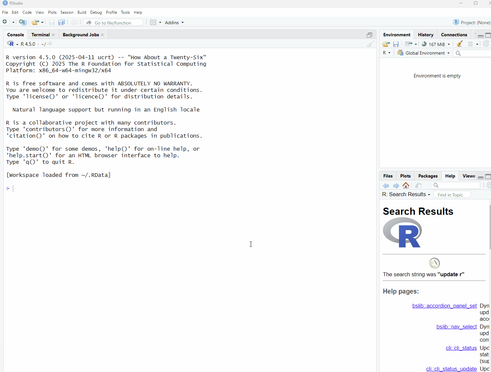

```{r setup, include=FALSE}
knitr::opts_chunk$set(message = FALSE, warnings = FALSE)
```

## Collecting and Cleaning Survey Data

Before we jump into cleaning survey data, it's helpful to get a sense of what the survey actually looks like.  Ideas of survey and study design are a bit beyond the focus of this course, but you're encouraged to think about these ideas as you go through these materials, and if you're attending a session live, please feel free to ask questions and offer insights!

### Our Research Question

For the purpose of this course, we're going to frame things with an overarching research question:

**How does social media usage influence the mental health of university students?**

This is a huge question, and you can imagine that to get a proper answer you would have to ask far too many questions in a survey, that most people wouldn't want to finish.  You can also imagine that you might also want to include things like interviews with a variety of groups, explore social media algorithms, explore the different types of content that social media has to offer, etc.  

Because covering all of this would be far too much for this course, we're going to focus on a fairly short survey as a way to get a sense managing this type of data.  However, these concepts apply broadly beyond this course, and there's also the possibility that there will be future branches of this course to cover additional types of data (stay tuned!).

### Our Survey

The survey we're going to be working with was created using Google Forms because it is an open platform that is freely accessible to anyone with a computer.  The survey was designed in such a way to utilize every question type that the tool offers so you can see how these different question types produce different data types, as well as how to work with these different data types.  Despite using Google Forms, the actions we'll perform in this workshop apply to any survey tool that you might use.

So to start things off, take a couple minutes to go through the survey: [survey link](https://docs.google.com/forms/d/e/1FAIpQLScZEp7MPaCz6G9TgiiZ-q4LjAgfMFsAAa-3RhNZqHFUfrREaw/viewform?usp=header)

### Our Data

Now that we know what the survey / data collection looks like, let's take a look at the data.  The dataset that we'll be using contains mock entries that resemble some general trends you might find in a real survey of this kind.

<a href="/data/survey-cleaning-workshop/social-media-survey.csv" download> Download the dataset</a>

:::question

Let's take a look at the dataset!

* Is it what you expected to see?
* Are there any fields that you think might be tricky to work with?
* Can you imagine how the data might need to change in order to ask questions of it?

:::

#### A Quick Blurb on CSV files

When downloading data from a survey tool, most platforms by default will export to a `.csv` file.  `.csv`, which stands for "comma separated values", are plain text, non-proprietary file formats, meaning that they can be opened by any plain text editor (like notepad, or textEdit), and do not rely on any paid-for software (this is also very helpful for others to access and reuse your data). `.csv` files are also the preferable file format when working with spreadsheet data in programming languages like R and Python.

### Beginning Our Work

Now that we have our data, we can start getting to work!  

The first thing we need to do is to create a project folder to keep our files in one place. To keep everything consistent, follow these steps:

1) Go to your `Documents` folder
2) Create a folder called `social_media_project`
3) Move the file you just downloaded, called `social-media-survey.csv` to the `social_media_project` folder

:::note

**A quick note on folder and file naming**

Much like naming objects in R, that was covered in the Introduction to R session, when naming files and folders follow these practices:

* Only use letters in the English alphabet, number 0-9, dashes -, and underscores _
* Do not use spaces or special characters such as: ~!@#$%^&*()+=…
* Separate naming elements with dashes - and underscores _

:::

### Setting a Working Directory

When working in a coding environment, you need to let R (or other coding environments) know what folder you want to be working from so you can easily access your files.  This concept is know as **setting a working directory**.

There are two main ways of doing this in R:

1) You can use the `setwd()` function, by manually inserting your file path in the brackets like this:
  * `setwd("directory-name/secondary-directory/etc...")` 
  * See section on [File and Directory Paths](Block4-1_File-Paths.html) for more information on paths.
  
2) Selecting the `Session` tab in the toolbar, and selecting `Set Working Directory`:


  


