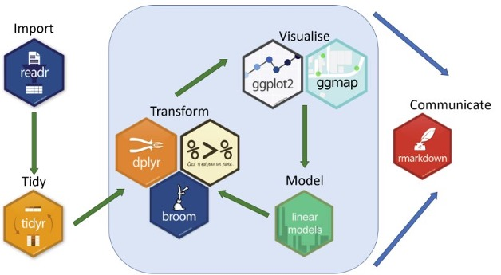
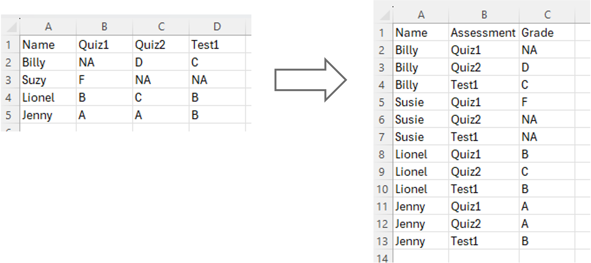

```{r setup, include=FALSE}
knitr::opts_chunk$set(message = FALSE, warnings = FALSE)
```

## Collecting and Cleaning Survey Data

Before we jump into cleaning survey data, it's helpful to get a sense of what the survey actually looks like. Ideas of survey and study design are a bit beyond the focus of this course, but you're encouraged to think about these concepts as you go through these materials. If you're attending a session live, please feel free to ask questions and offer insights!

### Our Research Question: 
### **How does social media usage influence the mental health of university students?**

There could be a number of ways to address this question, but for the purpose of this course we're going to focus on a fairly short survey as a way to get a sense managing this type of data.  

### Our Survey

The survey we're going to be working with was created using Google Forms because it is an open platform that is freely accessible to anyone with a computer.  The survey was designed in such a way to use the main question types offered by survey tools.  This will allow us to see how these different question types produce different types of data, and then explore how to work with these different data types.  Despite using Google Forms, the actions we'll perform in this workshop apply to any survey tool that you might use.

So to start things off, take a couple minutes to go through the survey: [survey link](https://docs.google.com/forms/d/e/1FAIpQLScZEp7MPaCz6G9TgiiZ-q4LjAgfMFsAAa-3RhNZqHFUfrREaw/viewform?usp=header)

### Our Data

Now that we know what the survey / data collection looks like, let's take a look at the data.  The dataset that we'll be using contains mock entries that resemble some general trends you might find in a real survey of this kind.

<a href="https://nickrochlin.github.io/rdm-jumpstart2/data/survey-cleaning-workshop/social-media-survey.csv" download>
  Download the dataset
</a>

:::question

Let's take a look at the dataset!

* Is it what you expected to see?
* Are there any fields that you think might be tricky to work with?
* Can you imagine how the data might need to change in order to ask questions of it?

:::

#### A Quick Blurb on CSV files

When downloading data from a survey tool, most platforms by default will export to a `.csv` file.  `.csv`, which stands for "comma separated values", are plain text, non-proprietary file formats, meaning that they can be opened by any plain text editor (like notepad, or textEdit), and do not rely on any paid-for software (this is also very helpful for others to access and reuse your data). `.csv` files are also the preferable file format when working with spreadsheet data in programming languages like R and Python.

For more information on file formats, see <a href="Block3-1_Excel-to-R.html">Block 3: Reproducible Research and Moving from Excel to Scripting</a>

### Beginning Our Work

Now that we have our data, we can start getting to work!  

The first thing we need to do is to create a project folder to keep our files in one place. To keep everything consistent, follow these steps:

1) Go to your `Documents` folder
2) Create a folder called `social_media_project`
3) Move the file you just downloaded, called `social-media-survey.csv` to the `social_media_project` folder
4) It is best practice to **save a copy of your original data and not to touch it**, to retain transparency and reproducibility. Make a copy of `social-media-survey.csv` and change the name of the copied file to `social-media-survey_ORIGINAL.csv`

:::note

**A quick note on folder and file naming**

Much like naming objects in R, that was covered in the <a href="/Block8-1_SUR_Intro-to-R.html">the Introduction to R</a>, when naming both **files and folders** follow these practices:

* Only use letters in the English alphabet, number 0-9, dashes -, and underscores _
* Do not use spaces or special characters such as: ~!@#$%^&*()+=…
* Separate naming elements with dashes - and underscores _

:::


### Setting a Working Directory

When working in a coding environment like RStudio, you need to let R (or other coding environments) know what folder you want to be working from so you can easily access your files.  This concept is know as **setting a working directory**.  For more information on file paths and directories, see a href="Block4-1_File-Paths.html">File and Directory Paths</a>

There are two main ways of doing this in R:

1) You can use the `setwd()` function, by manually inserting your file path in the brackets like this:
  * `setwd("directory-name/secondary-directory/etc...")` 
  * See section on [File and Directory Paths](Block4-1_File-Paths.html) for more information on paths.
  
2) Selecting the `Session` tab in the toolbar, and selecting `Set Working Directory`:


## Let's Get Started!

Let's get started by opening a new R script.

To create an R script file, select File > New File > R Script


### Packages and Libraries

Now that we've set our working directory, there's one more thing to cover before we jump into the data, which is the ideas of **packages and libraries** in R.

When you first download R, it comes equipped with a number of pre-installed functions, or capabilities, that you can start using immediately.  This is often called "Base R".  However, for certain tasks and workflows, it can be beneficial to use more specialized tools, or functions, to accomplish work and facilitate workflows more efficiently.  This is where packages and libraries come into play.

:::note

* **Packages**: Packages are an extension of the pre-built functions in R, and can be installed to bring in specific functions to accomplish tasks, among many other things.  There are **tons** of R packages out there, but here is a list of some of the most common/useful ones: [Quick list of useful R packages](https://support.posit.co/hc/en-us/articles/201057987-Quick-list-of-useful-R-packages)

* **Libraries**: Once you have installed a package, they are stored as libraries in R.  You only have to install them once, and anytime you want to use the package you can use the `library()` function, which is described below.

:::


### Tidyverse

The Tidyverse is a very commonly used package for research and data science activities, and instead of being a single package, it is a collection of packages that are designed to work together and that focus on the connections between activities in the data science workflow.  Each package follows the same syntax, which makes learning them easier, and the website functions as a really good reference point if you're struggling with how to approach a specific task.




Let's take a closer look!  [Tidyverse](https://www.tidyverse.org/packages/)

<br>

### Install Package
To install a package we use the function `install.packages()`. 

When you install a package, you should do this in the **R console* because you don't need this saved in your script.

```{r}
#install.packages("tidyverse")
```

### Load Libraries
Packages are stored in libraries. Once a package is installed, we need to call the library with the function `library()`.  

It's best practice to load libraries in your script so that others can see what libraries need to be loaded to run the script.

```{r}
library(tidyverse)
```

:::flag
Note that the package name needs to be in quotations when installing the package, but not when loading the library.

Because packages only need to be installed once, we can do this in the R console as opposed to in the script.

Because libraries need to be loaded in each working session, we can do this in the R script so that others can see what libraries we are using and need to be loaded.
:::

## Reading Data


In order to start working with a dataset in R, we first need to import, or "read in", the data.  To do this, we will be using the [readr package](https://readr.tidyverse.org/) in the Tidyverse. 

### Read a csv file
Because our data is in `.csv` format, we'll be using the `read_csv()` fuction.

To import a csv file we can use the `read_csv()` function and assign it to a new object we will call `survey_data`. We create a new object to be able to call it in different functions later on.
```{r, eval=FALSE}
survey_data <- read_csv("social-media-survey.csv")
```

```{r, include=FALSE}
survey_data <- read_csv("data/survey-cleaning-workshop/social-media-survey.csv")
```


## Exploring Data

Before we start manipulating the data, it's good to get a sense of some ways to quickly explore the data.

### Listing Column Names
To ask for a list of all the column names in our dataset we can use the `names()` function.
```{r, eval=TRUE}
names(survey_data)
```


### Head Function
The head function will display the top rows of the dataset. It will include information about the default data type assigned to each column.
```{r, eval=TRUE}
head(survey_data)
```


## Cleaning Data

When we talk about "cleaning data", we're talking about manipulating the original data so that it's easier to start exploring trends, analyzing, and visualizing.  As we go through this process, it can be helpful to save different versions, or stages of the data, to help promote a transparent and reproducible process.  In this session, we're going to focus on some common cleaning techniques that are used on survey data.  

In the [Introduction to R session](Block8-1_SUR_Intro-to-R.html) we discussed **objects** and **functions**, and played with the idea of objects storing information, and functions manipulating the object/data.

Now we're going to start implementing **pipes** as a way to connect objects to **functions** and **arguments**.

#### Pipes

Pipes are used to chain steps of instructions or actions together, and often involve writing over an object to give it a new value. We'll walk through some examples of how this works, and start to see how the full syntax of R comes together.


<br>

### Changing Column Names

You'll notice that the column names are reflective of the questions in the survey. Some of these will work, those that are very long and have spaces in the names can be annoying to work with.  The first step in our cleaning will be to get all of the column names in a way that will be easy to work with.

To change column names we can use the function `rename()`.  The function `rename()` is part of the [dplyr package](https://dplyr.tidyverse.org/index.html) that was installed with tidyverse.

:::walkthrough
Type the following code to change the column name from "Year of Study" to "year_of_study"
```{r}
survey_data <- survey_data |>
  rename("year_of_study" = "Year of Study")
```

**Step-by-step explanation:**

* This command first starts off with the `survey_data` object, which is our dataset.
* The assignment operator comes next, and will re-write the information stored in `survey_data` with all the information that is to the right side of the operator.
* We then use the `survey_data` object and the pipe `|>` to tell R that we want to take the data that is stored in `survey_data`, and then do something to it (which is what comes after the pipe).
* The `rename` function is used to rename columns, and is always followed by brackets.  Inside those brackets, we'll put the new column name that we want in quotation marks `""`, followed by an equal sign `=`, followed by the existing column name in quotation marks `""`.
* We then run the command and hope it works!
:::


## Your Turn!

:::question
First, use the function`names()` to display the column names.
```{r, eval=FALSE}
names(survey_data)
```
:::

:::question
Now, see if you can change the `How many hours per day do you spend on social media?` column name to `hours-per-day`
```{r, class.source = 'fold-hide'}
survey_data <- survey_data |>
  rename("hours-per-day" = "How many hours per day do you spend on social media?") 
```

:::

:::question
Next, try to change the following 3 column names:

* Change `Which social media platforms do you use at least once a week?` to `platforms`
* Change `Social media makes me feel connected` to `eel-connected`
* Change `Social media increases my stress` to `province`

**Hint:** It can be tedious to do these changes one by one, but by using commas `,` you can rename column names with a single code chunk.  
```{r, class.source = 'fold-hide'}
survey_data <- survey_data |>
  rename("platforms" = "Which social media platforms do you use at least once a week?",
          "feel-connected" = "Social media makes me feel connected",
          "feel-increase-stress" = "Social media increases my stress") 
```
:::

:::question
Now, let's change the rest of the column names copy the following code. (If you feel you're starting to understand how this works, you can show the code below and `cope + paste` it into your script, or if you want some more practice, feel free to do it yourself!

```{r, class.source = 'fold-hide'}
survey_data <- survey_data |>
  rename( "feel-distracted" = "I find social media distracting from studies",
         "feel-improved-mood" = "Social media positively impacts my mood",
         "usage-stay-in-touch" = "Staying connected with friends/family",
         "usage-entertainment" = "Entertainment/passing time",
         "usage-networking" = "Academic or professional networking",
         "usage-news" = "Staying informed about news/events",
         "usage-expression" = "Self-expression/creativity",
         "timestamp" = "Timestamp",
         "name" = "Name",
         "email" = "Email",
         "age" = "Age",
         "gender" = "Gender")
```

:::


## Personal Idenfiers, ID Codes, and Data Versioning

You probably noticed that in this survey we collected names and email addresses. This can be necessary for several reasons, but it also poses ethical issues with respect to who is able to see this information. It is common practice to remove personal identifiers from survey data, but you may also wish to create a code for each entry should you ever need to connect information back to the respondent.

Let's try this is a few steps:

### Add an ID column

The `mutate()` function, that is part of the [dplyr package](https://dplyr.tidyverse.org/index.html) is useful when you want to create new columns that are functions of existing variables.

While not technically the function of an existing variable, we can use `mutuate` with the `row_number()` function to create a new column that will contain the number of each row, thus given entry a unique ID number.


```{r, eval=FALSE}
survey_data <- survey_data |>
  mutate(ID = row_number())
```

:::walkthrough
You can see that the grammar works in the same way as the `rename` function, which is one of the strengths of using the Tidyverse.  

* The mutate function is followed by brackets, and the first value that is entered is what you want the new column to be called.
* After the `=` sign, insert what is to go in the rows of the new column.
* In this case, `row_number()` is adding the number of the corresponding row to the column.

We'll play with more uses of `mutate` in just a little bit!
:::

<br>

### Move the ID column to the left-most position of the data

Having an ID column as the left-most, or first, column in your dataset makes things generally easier to keep track of.

The `relocate()` function, which is also part of the **dplyr** package, which does just what its name implies: it relocates columns in a dataset.

The default of `relocate` is to put the specified column in the first position, so we don't need to specify location for this task.

```{r, eval=FALSE}
survey_data <- survey_data |>
  relocate(ID)
```

:::note
Every time you make a change to your data, you can use the `View(survey_data)` function to check what was done.
:::

Before we go any further, let's save another copy of this data.  This will allow the data holder to have a copy of the data that has both the personal identifiers and the ID codes.  We won't be analyzing this dataset, but it will be necessary should you need to reconnect with respondents.  

<br>

#### Saving a dataset

Much like we did with reading `.csv` data into R, there is a similar command to save, or "write" `.csv` data back to your computer called `write_csv()`.  The syntax is as follows:

`write_csv(data-object-name, file="file-path/datafile-name.csv")`

If you use the same file name as the one you are working on, it will change that file based on what you've done.  However, **we don't want to touch our original data**, so we're going to make a new file to indicate that it has clean columns, ID codes, and personal identifiers.

```{r, eval=FALSE}
write_csv(survey_data, "survey-data_clean-cols_IDs.csv")
```


### Back to Cleaning!

Now that we've saved that version of the data, let's now remove the `email` and `name` columns to de-identify the dataset, and also remove some unnecessary columns.

#### Removing Columns

There are a number of ways to remove columns in R, we'll focus on the the `select` function from the `dplyr` package in Tidyverse.

This follows the same syntax that we've been using, and after the `select` function, you insert a dash `-`, or minus symbol, plus the name of the column you want to remove.

Let's start be removing the `timestamp` column by using its column name.

```{r, eval=FALSE}
survey_data <- survey_data |>
  select(-timestamp)
```

You can take a look at the dataset and now see that the `timestamp` column is now gone.

Let's now remove the identifiers `name` and `email`.  

:::question

See if you can remove the `name` and `email` columns, as we want to get rid of the identifying variables.

Hint: To do this is a single command, see if you can figure out how to use the `c()` function that was introduced in the [Introduction to R session](Block8-1_SUR_Intro-to-R.html)
```{r, class.source = 'fold-hide', eval = FALSE}

survey_data <- suvey_data |>
  select(-c(name, email))
```
:::


<br>

#### Save Another Version of the Data

Now that we have a dataset that has cleaned columns, no identifiers, and no unnecessary columns, let's save a copy of this should we ever need to go back to the beginning.

```{r, eval=FALSE}
write_csv(survey_data, "survey-data_clean-cols_no-ID.csv")
```

### Cleaning Values

Now that we've cleaned up the variables/columns, let's take a look at our dataset and see what values might need some work.

```{r, eval=FALSE}
View(survey_data)
```

## Cleaning Survey Values

Now that we've cleaned up our headers, it's time to start looking at the values to see if we'll be easily able to analyze them, or if they need cleaning too.  

If you take a look at the `platforms` column, you'll see that the values are pretty messy, and can include any combination of up to 6 options. This is very hard to work with, so we'll need to figure out the best way to format things.

### Long Data, Wide Data, and the Tidy Data Principles

In R, and specifically the Tidyverse, the [Tidy Data Principles](https://cran.r-project.org/web/packages/tidyr/vignettes/tidy-data.html) specify qualities of what is considered "tidy data", with data that doesn't meet all criteria being "messy data". They provide a standard way to organize data to "facilitate initial exploration and analysis of the data, and to simplify the development of data analysis tools that work well together".  ([source](https://cran.r-project.org/web/packages/tidyr/vignettes/tidy-data.html)).  

**Tidy Data Principles:**

* Each variable is a column.
* Each observation is a row.
* Each value is a cell. 

Here is an example of what would be considered a messy dataset:


While structuring data in this way is much easier for a human to scan and for summary tables, it's trickier for a coding language to parse and work with.  The various packages of the Tidyverse are specifically geared towards working with tidy data, and making your data tidy will make faceting, grouping, modelling, and visualizing much easier.

Here's an example of what a tidy version of this data would look like:



As you'll notice, the repeating values in the `Name` column seems clunky and weird to scan.  But a way to think about think about why this might be useful would be if instead of 3 quizs, there were 50.  Having a unique column for each would be tedious in its own way, and this is just a single variable. There could be several sets of wide spanning columns to capture what could be captured in a single variable.  The concept of tidy data focuses on minimizing the amount of columns in favour of fewer columns with rich amounts of observations.

## Making a Dataset Tidy

The [tidyr](https://tidyr.tidyverse.org/) package in the Tidyverse specializes in making data tidy.

The `seperate_longer_delim()` function specializes in dealing with the messy values in our `platforms` column.

The `trimsw` function is useful to add with the `sepearate_longer_delim()` function, because it removes all the white space surrounding on either side of a value, avoiding any complications this could bring up.

:::walkthrough

Let's give this a try!

```{r}
survey_data_long <- survey_data |>
  separate_longer_delim(cols = platforms, delim = ",") |> 
  mutate(platforms = trimws(platforms)) 
```

**Step-by-step explanation**

1) We start off by creating a new r object called `survey_data_long`, which is going to take on all the information that is passed to it from the right side of the assignment operator `<-`.
2) The `survey_data` object represents our dataset that we want to pass through the pipe `|>` to manipulate it.
3) The `sepearate_longer_delim` function is applied to the `platforms` column to create a new row for each of the values in the cell, and because the values separated by commas, the `delim = ","` function tells R to separate each new row after a comma.
4) The data object with the separate rows is then piped into the next function, which uses the `mutate` function to tell R that we want to modify the newly updated `platforms` values, and the `trimsw` then removes any whitespace on either side of the values.
5) Et voila!

:::


If we take another look at the dataset, you'll see that the `platforms` variable now has single observations in each cell.

### More Tidying

In addition to the `platforms` variable, the survey contained two additional multiple-choice questions:

* "Please indicate how much you agree or disagree with the following statements about social media and your mental health:"

* "Rank the following reasons for using social media in order of importance to you (1 = most important, 5 = least important):"

You'll notice that each of these questions create create 4 and 5 columns, respectively, to capture the responses.  This isn't necessarily a bad thing, but in the spirit of making our data tidy, let's see try to reduce the amount of variables to represent these values.

:::question

Take a look at the dataset, focusing on the variables that begin with `feel-` and `usage-`, and think about how you might make these variables tidy.

:::

These variables are a bit trickier to conceptualize than the platforms variable, but R has a function that is designed to handle things like this, and will hopefully make sense when you see it!

:::walkthrough

Here's the code to do this:

```{r}
survey_data_longer <- survey_data_long |>
  pivot_longer(
    cols = starts_with("feel-"),
    names_to = "feel_question",
    values_to = "feel_response"
  )
```

**Step-by-step explanation:**

1) We start by writing a new r object called `survey_data_longer`, that will hold everything to the left of the assignment operator `|>`.
2) The `survey_data_long` object represents our dataset that we want to pass through the pipe `|>` to manipulate it.
3) The `pivot_longer()` function reshapes the data from wide to long.  In this case we had several variables that started with `feel-`, and this function will gather them into two columns: one for the question name and one for the response value.
4) The `cols = starts_with("feel-")` function tells `pivot_longer` which columns to gather. (You can see why variable naming can help with data cleaning!)
5) `names_to = "feel_question"` names of the new column that will **hold the original column names** (ie. the question identifiers.  The new column will be called `feel_question`.
6) `values_to` "feel_response" names the new column that will **hold the values (answers) that used to sit in the `feel-` columns.  The new column will be called `feel_response`.
7) Close the bracket, and take a look to see what the data looks like.

:::

## Your Turn!

::: question

Now that you've seen how the `pivot_long()` function works, see if you can create a new object called `survey_data_tidy`, that lenghthen the `usage-` columns just as we did with the `feel-` columns.

Hint: The syntax is exactly the same as the example above, you just need to the values in quotations `""`.

```{r, class.source = 'fold-hide', eval = FALSE}
survey_data_tidy <- survey_data_longer |>
  pivot_longer(
  cols = starts_with("usage-"),
  names_to = "usage_question",
  values_to = "usage_response"
)
```

:::

Take a look at the data:

```{r, eval=FALSE}
View(survey_data_tidy)
```

It looks pretty weird!  As mentioned, tidy data is very hard to scan for a human, but really easy for R to scan. You might notice that there's over 26,000 rows, which may seem overwhelming and unnecessary.  The Tidy Data Principles are very much geared towards using R, and there are times when making your data completely tidy might not suite your purpose.  However, the purpose of the exercise was to get you to think about how you might want or need to structure your data, and you now have code that you can easily adapt to play with your surveys.


### Save a copy of the data

Now that we've fully tidied our dataset, save a copy of it:

```{r, eval=FALSE}
write_csv(survey_data_tidy, "survey_data_tidy.csv")
```


## Making Data Wide

In the next session of this series, [Making Sense of Survey Data](Block8-3_SUR_Making-Sense.html), we will be using this tidied version of our data to dip our toes in analysis and visualization.  However, it is worth noting that for certain surveys, keeping the wide structure might be preferable to make it easier for human eyes to scan and creating basic summary tables.  

We can take a quick look at an example of widening data, using the `platforms` variable that we previously made long.

If we revisit the R object `survey_data`, which was saved as the `survey-data_clean-cols_no-ID.csv` file, we can step back to a stage in which the `platforms` variable was still quite messy.

```{r, eval=FALSE}
View(survey_data)
```

Instead of creating a new row for each of the platforms via the Tidy Data Principles, we can make the data wider and create a new column for each of the platforms.

:::walkthrough

Here's how to do this:

```{r}
survey_data_wide <- survey_data |>
  mutate(platforms = strsplit(platforms, ",")) |>
  unnest_longer(platforms) |>
  mutate(platforms = trimws(platforms), present = 1) |>
  pivot_wider(
    names_from = platforms,
    values_from = present,
    values_fill = 0
  )
```

**Step-by-step explanation:**

1) We start by writing a new r object called `survey_data_wide`, that will hold everything to the left of the assignment operator `|>`.
2) The `survey_data` object represents our dataset that we want to pass through the pipe `|>` to manipulate it.
3) The `mutate` function is used to modify a column, which is applied to the `strsplit(platforms, ",")` function, to tell it to split the comma-separated strings in the `platforms` column into lists of individual platform names.
4) We then pipe `|>` this into the `unnest_longer(platforms)` function to expand each element into its own row (which is like making the data longer)
5) This is then piped `|>` into `mutate(platforms = trimws(platforms)` which continues to manipulate the `platforms` column, and much like we did when making this variable long, the `trimsw` removes white space surrounding the values.
6) The `present = 1` function creates a new column called `present` that has a value of 1 for every row.  This is used as a temporary marker to indicate that the platform exists for that survey entry, and will not be there 
7) Using another pipe `|>`, this information goes into the `pivot_wider` function, that works with a very similar syntax as `pivot_longer` that we used earlier.  
8) `names_from = platforms` assigns new columns to the unique platform names.
9) `values_from = present` assigns values in the new columns to come from the `present` column, which is `1`.
10) Finally, with `values_fill = 0`, if a platform wasn't present for a survey entry, that column will get the value of `0`.

This will end up with a wide dataset where each row is a survey entry, each platformat is a column, and the value `1` means a platform was listed, and `0` means a platform was not listed.

::: 

## Finish

You have now seen some of the foundational functions to clean survey data, and the various types of data that a survey might create. The goal of this session is to give you a sense of how to approach your own survey data, and to be comfortable enough with these code chunks that you can switch out the data/variables for your own surveys, and work through them in quick and reproducible ways!


