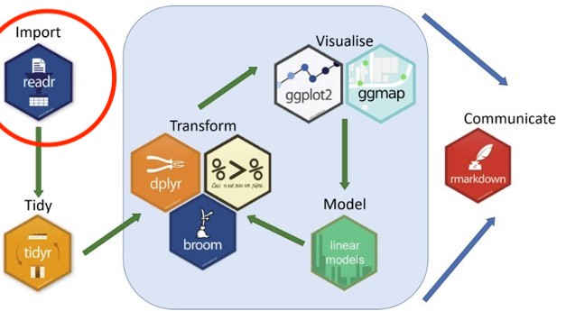

```{r setup, include=FALSE}
knitr::opts_chunk$set(message = FALSE, warnings = FALSE)
```

## Collecting and Cleaning Survey Data

Before we jump into cleaning survey data, it's helpful to get a sense of what the survey actually looks like. Ideas of survey and study design are a bit beyond the focus of this course, but you're encouraged to think about these concepts as you go through these materials. If you're attending a session live, please feel free to ask questions and offer insights!

### Our Research Question: 
### **How does social media usage influence the mental health of university students?**

There could be a number of ways to address this question, but for the purpose of this course we're going to focus on a fairly short survey as a way to get a sense managing this type of data.  

### Our Survey

The survey we're going to be working with was created using Google Forms because it is an open platform that is freely accessible to anyone with a computer.  The survey was designed in such a way to use the main question types offered by survey tools.  This will allow us to see how these different question types produce different types of data, and then explore how to work with these different data types.  Despite using Google Forms, the actions we'll perform in this workshop apply to any survey tool that you might use.

So to start things off, take a couple minutes to go through the survey: [survey link](https://docs.google.com/forms/d/e/1FAIpQLScZEp7MPaCz6G9TgiiZ-q4LjAgfMFsAAa-3RhNZqHFUfrREaw/viewform?usp=header)

### Our Data

Now that we know what the survey / data collection looks like, let's take a look at the data.  The dataset that we'll be using contains mock entries that resemble some general trends you might find in a real survey of this kind.

<a href="https://nickrochlin.github.io/rdm-jumpstart2/data/survey-cleaning-workshop/social-media-survey.csv" download>
  Download the dataset
</a>

:::question

Let's take a look at the dataset!

* Is it what you expected to see?
* Are there any fields that you think might be tricky to work with?
* Can you imagine how the data might need to change in order to ask questions of it?

:::

#### A Quick Blurb on CSV files

When downloading data from a survey tool, most platforms by default will export to a `.csv` file.  `.csv`, which stands for "comma separated values", are plain text, non-proprietary file formats, meaning that they can be opened by any plain text editor (like notepad, or textEdit), and do not rely on any paid-for software (this is also very helpful for others to access and reuse your data). `.csv` files are also the preferable file format when working with spreadsheet data in programming languages like R and Python.

For more information on file formats, see <a href="Block3-1_Excel-to-R.html">Block 3: Reproducible Research and Moving from Excel to Scripting</a>

### Beginning Our Work

Now that we have our data, we can start getting to work!  

The first thing we need to do is to create a project folder to keep our files in one place. To keep everything consistent, follow these steps:

1) Go to your `Documents` folder
2) Create a folder called `social_media_project`
3) Move the file you just downloaded, called `social-media-survey.csv` to the `social_media_project` folder
4) It is best practice to **save a copy of your original data and not to touch it**, to retain transparency and reproducibility. Make a copy of `social-media-survey.csv` and change the name of the copied file to `social-media-survey_ORIGINAL.csv`

:::note

**A quick note on folder and file naming**

Much like naming objects in R, that was covered in the a href="/Block8-1_SUR_Intro-to-R.html">the Introduction to R</a>, when naming both **files and folders** follow these practices:

* Only use letters in the English alphabet, number 0-9, dashes -, and underscores _
* Do not use spaces or special characters such as: ~!@#$%^&*()+=…
* Separate naming elements with dashes - and underscores _

:::


### Setting a Working Directory

When working in a coding environment like RStudio, you need to let R (or other coding environments) know what folder you want to be working from so you can easily access your files.  This concept is know as **setting a working directory**.  For more information on file paths and directories, see a href="Block4-1_File-Paths.html">File and Directory Paths</a>

There are two main ways of doing this in R:

1) You can use the `setwd()` function, by manually inserting your file path in the brackets like this:
  * `setwd("directory-name/secondary-directory/etc...")` 
  * See section on [File and Directory Paths](Block4-1_File-Paths.html) for more information on paths.
  
2) Selecting the `Session` tab in the toolbar, and selecting `Set Working Directory`:


## Let's Get Started!

Let's get started by opening a new R script.

To create an R script file, select File > New File > R Script


### Packages and Libraries

Now that we've set our working directory, there's one more thing to cover before we jump into the data, which is the ideas of **packages and libraries** in R.

When you first download R, it comes equipped with a number of pre-installed functions, or capabilities, that you can start using immediately.  This is often called "Base R".  However, for certain tasks and workflows, it can be beneficial to use more specialized tools, or functions, to accomplish work and facilitate workflows more efficiently.  This is where packages and libraries come into play.

:::note

* **Packages**: Packages are an extension of the pre-built functions in R, and can be installed to bring in specific functions to accomplish tasks, among many other things.  There are **tons** of R packages out there, but here is a list of some of the most common/useful ones: [Quick list of useful R packages](https://support.posit.co/hc/en-us/articles/201057987-Quick-list-of-useful-R-packages)

* **Libraries**: Once you have installed a package, they are stored as libraries in R.  You only have to install them once, and anytime you want to use the package you can use the `library()` function, which is described below.

:::


### Tidyverse

The Tidyverse is a very commonly used package for research and data science activities, and instead of being a single package, it is a collection of packages that are designed to work together and that focus on the connections between activities in the data science workflow.  Each package follows the same syntax, which makes learning them easier, and the website functions as a really good reference point if you're struggling with how to approach a specific task.




Let's take a closer look!  [Tidyverse](https://www.tidyverse.org/packages/)

<br>

## Let's get started!

First, let's create a new R script.

To create an R script file, select File > New File > R Script


### Install Package
To install a package we use the function `install.packages()`. 

When you install a package, you should do this in the **R console* because you don't need this saved in your script.

```{r}
#install.packages("tidyverse")
```

### Load Libraries
Packages are stored in libraries. Once a package is installed, we need to call the library with the function `library()`.  

It's best practice to load libraries in your script so that others can see what libraries need to be loaded to run the script.

```{r}
library(tidyverse)
```

:::flag
Note that the package name needs to be in quotations when installing the package, but not when loading the library.

Because packages only need to be installed once, we can do this in the R console as opposed to in the script.

Because libraries need to be loaded in each working session, we can do this in the R script so that others can see what libraries we are using and need to be loaded.
:::

## Reading Data


In order to start working with a dataset in R, we first need to import, or "read in", the data.  To do this, we will be using the [readr package](https://readr.tidyverse.org/) in the Tidyverse. 

### Read a csv file
Because our data is in `.csv` format, we'll be using the `read_csv()` fuction.

To import a csv file we can use the `read_csv()` function and assign it to a new object we will call `survey_data`. We create a new object to be able to call it in different functions later on.
```{r, eval=FALSE}
survey_data <- read_csv("social-media-survey.csv")
```

```{r, include=FALSE}
survey_data <- read_csv("data/survey-cleaning-workshop/social-media-survey.csv")
```


## Exploring Data

Before we start manipulating the data, it's good to get a sense of some ways to quickly explore the data.

### Listing Column Names
To ask for a list of all the column names in our dataset we can use the `names()` function.
```{r, eval=TRUE}
names(survey_data)
```


### Head Function
The head function will display the top rows of the dataset. It will include information about the default data type assigned to each column.
```{r, eval=TRUE}
head(survey_data)
```


## Cleaning Data

You'll notice that the column names are reflective of the questions in the survey. Some of these will work, those that are very long and have spaces in the names can be annoying to work with.  The first step in cleaning data is getting all of the column names in a way that will be easy to work with.

In the [Introduction to R session](Block8-1_SUR_Intro-to-R.html) we discussed **objects** and **functions**, and played with the idea of objects storing information, and functions manipulating the object/data.

Now we're going to start implementing **pipes** as a way to connect objects to **functions** and **arguments**.

#### Pipes

Pipes are used to chain steps of instructions or actions together, and often involve writing over an object to give it a new value. We'll walk through some examples of how this works, and start to see how the full syntax of R comes together.


<br>

### Changing Column Names

To change column names we can use the function `rename()`.  The function `rename()` is part of the [dplyr package](https://dplyr.tidyverse.org/index.html) that was installed with tidyverse.

:::walkthrough
Type the following code to change the column name from "Year of Study" to "year_of_study"
```{r}
survey_data <- survey_data |>
  rename("year_of_study" = "Year of Study")
```

**Step-by-step explanation:**

* This command first starts off with the `survey_data` object, which is our dataset.
* The assignment operator comes next, and will re-write the information stored in `survey_data` with all the information that is to the right side of the operator.
* We then use the `survey_data` object and the pipe `|>` to tell R that we want to take the data that is stored in `survey_data`, and then do something to it (which is what comes after the pipe).
* The `rename` function is used to rename columns, and is always followed by brackets.  Inside those brackets, we'll put the new column name that we want in quotation marks `""`, followed by an equal sign `=`, followed by the existing column name in quotation marks `""`.
* We then run the command and hope it works!
:::


## Your Turn!

:::question
First, use the function`names()` to display the column names.
```{r, eval=FALSE}
names(survey_data
```
:::

:::question
Now, see if you can change the `How many hours per day do you spend on social media?` column name to `hours-per-day`
```{r, class.source = 'fold-hide'}
survey_data <- survey_data |>
  rename("hours-per-day" = "How many hours per day do you spend on social media?") 
```

:::

:::question
Next, try to change the following 3 column names:

* Change `Which social media platforms do you use at least once a week?` to `platforms`
* Change `Social media makes me feel connected` to `eel-connected`
* Change `Social media increases my stress` to `province`

**Hint:** It can be tedious to do these changes one by one, but by using commas `,` you can rename column names with a single code chunk.  
```{r, class.source = 'fold-hide'}
survey_data <- survey_data |>
  rename("platforms" = "Which social media platforms do you use at least once a week?",
          "feel-connected" = "Social media makes me feel connected",
          "feel-increase-stress" = "Social media increases my stress") 
```
:::

:::question
Now, let's change the rest of the column names copy the following code. (If you feel you're starting to understand how this works, you can show the code below and `cope + paste` it into your script, or if you want some more practice, feel free to do it yourself!

```{r, class.source = 'fold-hide'}
survey_data <- survey_data |>
  rename( "feel-distracted" = "I find social media distracting from studies",
         "feel-improved-mood" = "Social media positively impacts my mood",
         "usage-stay-in-touch" = "Staying connected with friends/family",
         "usage-entertainment" = "Entertainment",
         "usage-news" = "News and current events",
         "usage-networking" = "Academic or professional networking",
         "usage-expression" = "Self-expression/creativity",
         "timestamp" = "Timestamp",
         "name" = "Name",
         "email" = "Email")
```

:::


### Personal Idenfiers, ID Codes, and Data Versioning

You probably noticed that in this survey we collected names and email addresses. This can be necessary for several reasons, but it also poses ethical issues with respect to who is able to see this information. It is common practice to remove personal identifiers from survey data, but you may also wish to create a code for each entry should you ever need to connect information back to the respondent.

Let's try this is a few steps:

<br>

#### Add an ID column

The `mutate()` function, that is part of the [dplyr package](https://dplyr.tidyverse.org/index.html) is useful when you want to create new columns that are functions of existing variables.

While not technically the function of an existing variable, we can use `mutuate` with the `row_number()` function to create a new column that will contain the number of each row, thus given entry a unique ID number.


```{r}
survey_data <- survey_data |>
  mutate(ID = row_number())
```

:::walkthrough
You can see that the grammar works in the same way as the `rename` function, which is one of the strengths of using the Tidyverse.  

* The mutate function is followed by brackets, and the first value that is entered is what you want the new column to be called.
* After the `=` sign, insert what is to go in the rows of the new column.
* In this case, `row_number()` is adding the number of the corresponding row to the column.

We'll play with more uses of `mutate` in just a little bit!
:::

<br>

#### Move the ID column to the left-most position of the data

Having an ID column as the left-most, or first, column in your dataset makes things generally easier to keep track of.

The `relocate()` function, which is also part of the **dplyr** package, which does just what its name implies: it relocates columns in a dataset.

The default of `relocate` is to put the specified column in the first position, so we don't need to specify location for this task.

```{r}
survey_data <- survey_data |>
  relocate(ID)
```

:::note
Every time you make a change to your data, you can use the `View(survey_data)` function to check what was done.
:::

Before we go any further, let's save another copy of this data.  This will allow the data holder to have a copy of the data that has both the personal identifiers and the ID codes.  We won't be analyzing this dataset, but it will be necessary should you need to reconnect with respondents.  

<br>

#### Saving a dataset

Much like we did with reading `.csv` data into R, there is a similar command to save, or "write" `.csv` data back to your computer called `write_csv()`.  The syntax is as follows:

`write_csv(data-object-name, file="file-path/datafile-name.csv")`

If you use the same file name as the one you are working on, it will change that file based on what you've done.  However, **we don't want to touch our original data**, so we're going to make a new file to indicate that it has clean columns, ID codes, and personal identifiers.

```{r}
write_csv(survey_data, "survey-data_clean-cols_IDs.csv")
```


