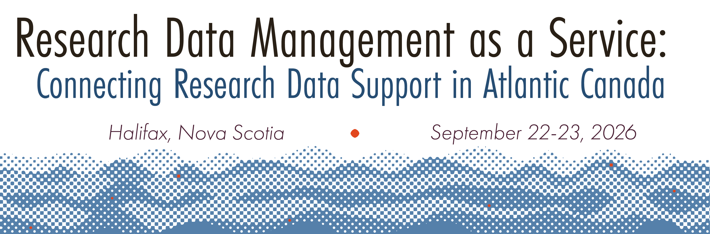

## Research Data Management (RDM) As a Service: Connecting Research Data Support in Atlantic Canada

This two-day event will bring together librarians, research ethics officers, research office staff, and research computing/IT specialists from post-secondary institutions in Atlantic Canada. Each of these groups play a key role in providing RDM support, and offer services that are inherently related, but are oftentimes disconnected due to a lack of coordination. Featuring case-study presentations and facilitated design sessions, the goal of this event will be to collaboratively create a practical set of tools and shared strategies to transform how the Atlantic region delivers RDM support. 

### Key Dates

The event will occur on **September 22-23, 2026 in Halifax, NS**. 

### Attending

We know that budgets to attend events are becoming more limited, and to ensure representation from a diverse range of institutions and regions in Atlantic Canada, travel and accommodation will be covered for those that are accepted to the event. We are still working on the application process, and communications will be sent out once things go live.

### Contact

If you have any questions about the event, please reach out to Sandra Sawchuk at: [rdm@msvu.ca](mailto:rdm@msvu.ca)

### Funding

We acknowledge the support of the Social Sciences and Humanities Research Council (SSHRC), whose funding has made this event possible, as well as sponsor organizations including:

* ACENET
* The Council of Atlantic Academic Libraries (CAAL)
* The Canadian Association of Research Libraries (CARL)
* The Digial Research Alliance of Canada
* Mount Saint Vincent University Centre on Aging
* Mount Saint Vincent University Library and Archives
* Mount Saint Vincent Univeristy Research Office

### Project Team

* Sandra Sawchuk, Mount Saint Vincent University 
* Nick Rochlin, University of Victoria 

